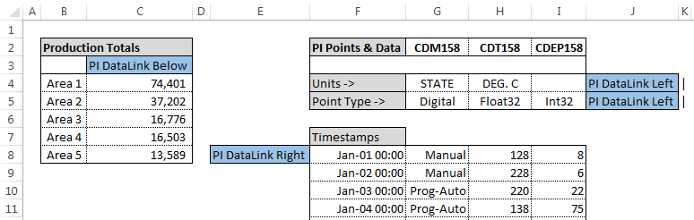
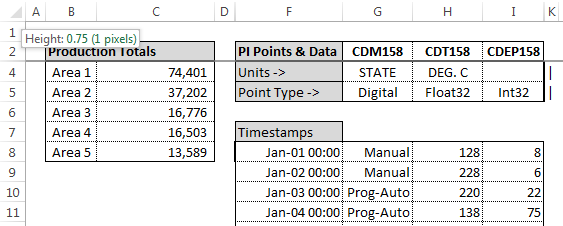

## Programmatically Recalculate (Resize) DataLink Functions in version 2014 and later

#### Issues

Content originally from KB01035

You want to programmatically select, resize, and recalculate a PI DataLink array, providing the same functionality as the "Recalculate (Resize) Function" option from the function's right-click menu.


------

#### Environment

PI DataLink 2014 and later

------

#### Solution

OSIsoft exposes the ability to select and resize PI DataLink functions using Macros with VBA.

- Starting in PI DataLink 2014, it is no longer necessary to reference pidldialogs.xla because the ResizeRange and SelectRange methods implemented for the Explore Events and Compare Events functions are exposed to VBA through the [AddInUtilities class](https://msdn.microsoft.com/en-us/library/bb608621.aspx).

------

#### Cause

When a PI DataLink function writes a function array, it [automatically sizes](https://livelibrary.osisoft.com/LiveLibrary/content/en/datalink-v6/GUID-7455178C-F992-4F07-A2CB-F5CDC8D765AD) the array to fit the returned data. Functions write the function array when you click **OK** or **Apply** on the task pane or when you click **Recalculate (Resize) Function** on the shortcut menu.

Other methods that recalculate or update a function do not write a new function array. These methods only update array values; the array size remains unchanged. For example, if you specify function inputs with cell references and change the value in a cell, the function will update returned values but the size of the array remains the same. The update might return more or fewer values than the function array on the worksheet can show. Settings control what PI DataLink returns:

- If an update returns fewer values, PI DataLink either returns blanks or #N/A in the cells without values.
- If the update returns more values than the function array can show, PI DataLink returns the text *Resize to show all values* at the bottom of the array unless the preference settings disable the message.

Note the VBA examples presented in this article run significantly faster when **Disable automatic task pane display on click** is selected in **DataLink settings:**


**DISCLAIMER**: The examples below are not tested by OSIsoft as part of our release cycle, and as such we cannot guarantee that they will work without issue.


The following VBA examples are presented:

- Recalculate and resize PI DataLink functions in all sheets using keywords.
- Select and resize PI DataLink functions in a specific location.
- Select and resize PI DataLink functions using two separate buttons.


#### Recalculate and resize PI DataLink functions in all sheets using keywords

1. Enter the keywords "PI DataLink Right", "PI DataLink Left", or "PI DataLink Below" so the PI DataLink functions are appropriately located to the right, left, or below the keyword cells:
   

2. The keywords can be obscured by changing the column width or row height to 1+ pixels.
   - NOTE: The keywords cannot be found and the VBA will not work if the columns or rows are set to Hide or 0 pixels
     

3. Add a form control button to the Excel spreadsheet referencing [Microsoft documentation](https://support.office.com/en-us/article/assign-a-macro-to-a-form-or-a-control-button-d58edd7d-cb04-4964-bead-9c72c843a283).
4. Assign a Macro to the button with the VBA provided below.

- The VBA uses the keywords to recalculate PI DataLink functions in all sheets.
- If preferred, edit the VBA to recalculate only the current sheet by making the following changes:
  1. Replace text "For Each sh In ThisWorkbook.Worksheets" with "Set sh = ActiveSheet"
  2. Delete text "Next sh"
- If a message box appears saying "No cells found" when running the VBA, it may be because a keyword match was found without finding a PI DataLink function in the adjacent column/row, or due to a hidden column/row between the keyword and PI DataLink function. 

```vb
Sub PIDLRecalculateResizeAllSheetsKeywordsOnly()

    Dim SearchString1, SearchString2, SearchString3 As String
    Dim cL As Range
    Dim FirstFound As String
    Dim sh As Worksheet
    Dim starting_ws As Worksheet
    Set starting_ws = ActiveSheet
    Dim myRange As Range
    
    Dim addIn As COMAddIn
    Dim automationObject As Object
    Set addIn = Application.COMAddIns("PI DataLink")
    Set automationObject = addIn.Object
    
    ''** Set search value
    SearchString1 = "PI DataLink Right"
    SearchString2 = "PI DataLink Left"
    SearchString3 = "PI DataLink Below"
    Application.FindFormat.Clear
    ''** Loop through all sheets
    For Each sh In ThisWorkbook.Worksheets  ''To target current sheet only, step 1 of 2: replace this line with the following: Set sh = ActiveSheet
        sh.Activate
        ''** Find first instance on sheet
        Set cL = sh.Cells.Find(what:=SearchString1, _
            After:=sh.Cells(1, 1), _
            LookIn:=xlValues, _
            LookAt:=xlWhole, _
            SearchOrder:=xlByRows, _
            SearchDirection:=xlNext, _
            MatchCase:=False, _
            SearchFormat:=False)
        If Not cL Is Nothing Then
            FirstFound = cL.Address
            Do
                'cL.Font.Bold = False
                'cL.Interior.ColorIndex = 8
                Set myRange = Range(cL.Offset(0, 1).Address)
                myRange.Select
                If myRange.HasArray Then
                    automationObject.ResizeRange
                Else
                    Selection.Value = Selection.FormulaR1C1
                End If
                ''** Find next instance on sheet
                Set cL = sh.Cells.FindNext(After:=cL)
            Loop Until cL.Address = FirstFound
        End If
        
        Set cL = sh.Cells.Find(what:=SearchString2, _
            After:=sh.Cells(1, 1), LookIn:=xlValues, LookAt:=xlWhole, SearchOrder:=xlByRows, SearchDirection:=xlNext, MatchCase:=False, SearchFormat:=False)
        If Not cL Is Nothing Then
            FirstFound = cL.Address
            Do
                Set myRange = Range(cL.Offset(0, -1).Address)
                myRange.Select
                If myRange.HasArray Then
                    automationObject.ResizeRange
                Else
                    Selection.Value = Selection.FormulaR1C1
                End If
                Set cL = sh.Cells.FindNext(After:=cL)
            Loop Until cL.Address = FirstFound
        End If
        
        Set cL = sh.Cells.Find(what:=SearchString3, _
            After:=sh.Cells(1, 1), LookIn:=xlValues, LookAt:=xlWhole, SearchOrder:=xlByRows, SearchDirection:=xlNext, MatchCase:=False, SearchFormat:=False)
        If Not cL Is Nothing Then
            FirstFound = cL.Address
            Do
                Set myRange = Range(cL.Offset(1, 0).Address)
                myRange.Select
                If myRange.HasArray Then
                    automationObject.ResizeRange
                Else
                    Selection.Value = Selection.FormulaR1C1
                End If
                Set cL = sh.Cells.FindNext(After:=cL)
            Loop Until cL.Address = FirstFound
        End If

    Next sh ''To target current sheet only, step 2 of 2: delete this line
    starting_ws.Activate
    Range("A1").Select
    ''** NOTES:
    '' If a message box appears saying "No cells found",
    '' it may be because a SearchString match was found
    '' without finding a PI DataLink function in the adjacent column/row,
    '' or due to a hidden column/row between the keyword and PI DataLink function.
End Sub
```


### Select and resize PI DataLink functions in a specific location

Once initial substitutions are made to tailor this solution to your particular worksheet, all DataLink arrays will be resized with a single click. Contact Tech Support for an example file that implements the sample code discussed below.

To adjust the sample code to your particular worksheet:

1. Open the VBA Editor (Alt+F11) and double-click the ResizeAll module in the Project Explorer pane. If you use your workbook instead of the example file, create a module and paste the sample code into it.
2. Change the 7 in "Dim allRanges(1To7)As Range" to the total number of DataLink arrays in your spreadsheet.
3. Update the cell references that populate the allRanges array to represent the top left cells of each PI DataLink array.

```vb
Sub PIDLResizeAll()
    Dim addIn As COMAddIn
    Dim automationObject As Object
    Set addIn = Application.COMAddIns("PI DataLink")
    Set automationObject = addIn.Object
    'To adjust this subroutine to another Excel worksheet, update the cell references in allRanges to reflect the top left cell of each DataLink array.
    'Then change the array size in the below line:
    Dim allRanges(1 To 7) As Range
    Dim i As Long   
 
    'Set the values of the allRanges array to the top left cell of each DataLink result array.
    Set allRanges(1) = Range("D2")
    Set allRanges(2) = Range("G2")
    Set allRanges(3) = Range("J2")
    Set allRanges(4) = Range("M2")
    Set allRanges(5) = Range("P2")
    Set allRanges(6) = Range("R2")
    Set allRanges(7) = Range("V2")
     
    For i = LBound(allRanges) To UBound(allRanges)
        'For each DataLink array, select the top left cell, then select all cells in the array, and finally resize the array.
        allRanges(i).Select
        automationObject.SelectRange
        automationObject.ResizeRange
    Next i
End Sub
```


### Select and resize PI DataLink functions using two separate buttons

To create two buttons that separately select and resize (recalculate) a PI DataLink function:

1. Open the VBA Editor (Alt+F11) and add two buttons to your spreadsheet.
2. Add the VBA code shown below.
   - The first button, which uses "ResizeRange", will resize the function array that occupies cell C1.
   - The second button, which uses "SelectRange", will select the function array that occupies cell E1.

```vb
Sub PIDLFunctionResize()    
    Dim addIn As COMAddIn
    Dim automationObject As Object
     
    Set addIn = Application.COMAddIns("PI DataLink")   
    Set automationObject = addIn.Object
     
    Dim MyRange As Range
    Set MyRange = Range("C1")
    MyRange.Select
     
    automationObject.ResizeRange
End Sub
 
 
Sub PIDLFunctionSelect()
    Dim addIn As COMAddIn
    Dim automationObject As Object
    Set addIn = Application.COMAddIns("PI DataLink")
    Set automationObject = addIn.Object
     
    Dim MyRange As Range
    Set MyRange = Range("E1")
    MyRange.Select
     
    automationObject.SelectRange
End Sub
```


[HowToExcel](https://www.howtoexcel.org/vba/how-to-add-a-form-control-button-to-run-your-vba-code/)  has the clear steps for implementing a form control button.

#### **Attachments and Sample Excel files**

- Attachments are located in the Related tab
- The "Sample..." documents can be e-mailed or shared with customers.
- The "INTERNALONLY..." document should not be shared, and is only for building our internal knowledge.

#### Additional option (Internal Only): Recalculate and resize all PI DataLink functions.

CAUTION:

- The following VBA should only be used for Excel spreadsheets that contain a small number of PI DataLink functions. For example, fewer than 300,000 output cells total, and fewer than 10 queries per PI DataLink function. This is because it finds and evaluates every output cell to see if it contains a unique PI DataLink function, and then repeats a PI DataLink function for each unique data item or expression. In testing on a client machine, a single Sampled Data function containing 10 PI DataLink data items that each contain 30,000 rows (300,000 output cells total) required 165 seconds. For comparison, the recommended VBA using keywords required 12 seconds.
- If needed, press CTRL+Break to stop the VBA code in case the Excel workbook contains a large number of functions or output cells.


Benefits:

- Finds all PI DataLink functions without adding keywords to the sheets or to hard-coding locations into VBA.
- Provides maximum flexibility to add/remove rows and columns, and to move PI DataLink functions around Excel. This may be useful for a dashboard or Executive Summary sheet.
- Documents this VBA option and its limits, and demonstrates why other options are recommended.


Implementation**:** 

The VBA below will recalculate all PI DataLink functions in all sheets. The code can be edited to only recalculate the current sheet by making the following changes. In this way, the code may be appropriate for one sheet (i.e. an Executive Summary) but not for the whole workbook:

- Replace text "For Each sh In ThisWorkbook.Worksheets" with "Set sh = ActiveSheet"
- Delete text "Next sh"

```vb
Sub RecalculateResizeAllSheets()

    Dim sh As Worksheet
    Dim starting_ws As Worksheet
    Set starting_ws = ActiveSheet
    
    Dim SearchString As String
    Dim cL As Range
    Dim FirstFound As String
    
    Dim coll As New Collection
    Set coll = New Collection
    
    Dim addIn As COMAddIn
    Dim automationObject As Object
    Set addIn = Application.COMAddIns("PI DataLink")
    Set automationObject = addIn.Object
    
    '** Set Search value
    SearchString = "=PI"
    Application.FindFormat.Clear
    
    '** Loop through each sheet
    For Each sh In ThisWorkbook.Worksheets
        '** Find first instance on each sheet
        sh.Activate
        Set coll = Nothing
        Set cL = sh.Cells.Find(what:=SearchString, _
            After:=sh.Cells(1, 1), _
            LookIn:=xlFormulas, _
            LookAt:=xlPart, _
            SearchOrder:=xlByRows, _
            SearchDirection:=xlNext, _
            MatchCase:=False, _
            SearchFormat:=False)
        If Not cL Is Nothing Then
            FirstFound = cL.Address
            '** Loop through all instances on sheet
            Do
                'cl.Font.Bold = False
                'cL.Interior.ColorIndex = 0
                Set cL = sh.Cells.FindNext(After:=cL)
                '** Only add unique formulas to collection (list)
                On Error Resume Next
                coll.Add Range(cL.Address).Formula, Range(cL.Address).Formula
            Loop Until FirstFound = cL.Address
        End If
    
        '** Loop through each formula listed in the collection
        For Each colval In coll
            Set cL = sh.Cells.Find(what:=colval, _
                After:=sh.Cells(1, 1), _
                LookIn:=xlFormulas, _
                LookAt:=xlPart, _
                SearchOrder:=xlByRows, _
                SearchDirection:=xlNext, _
                MatchCase:=False, _
                SearchFormat:=False)
            If Not cL Is Nothing Then
                'cl.Font.Bold = False
                'cL.Interior.ColorIndex = 10
                Dim myRange As Range
                Set myRange = Range(cL.Address)
                myRange.Select
                automationObject.ResizeRange
                Dim myRangeFixer As Range
                Do While True
                    Set myRangeFixer = Range(cL.Address).EntireColumn.Find(what:="Resize to show all values", LookIn:=xlValues)
                    If myRangeFixer Is Nothing Then
                        Exit Do
                    Else
                        myRangeFixer.Select
                        automationObject.ResizeRange
                    End If
                Loop
            End If
        Next colval
    'sh.Cells(1, 1) = "Processed" 'this sets cell A1 of each sheet to "Processed"
    Next sh
    starting_ws.Activate
    Range("A1").Select
    
    '** Optional: Display results from last sheet.  Move this VBA block before "Next sh" to see results for each sheet.
    'For Each colval In coll
    '    msg = msg & colval & vbNewLine
    'Next colval
    'MsgBox msg
    
End Sub
```


Product(s) and Version(s)

{"PI DataLink": ["5.1.0", "5.1.1.0", "5.2.0.0", "5.3.0.0", "5.4.0.0", "5.4.1.0", "5.4.2.0"]}